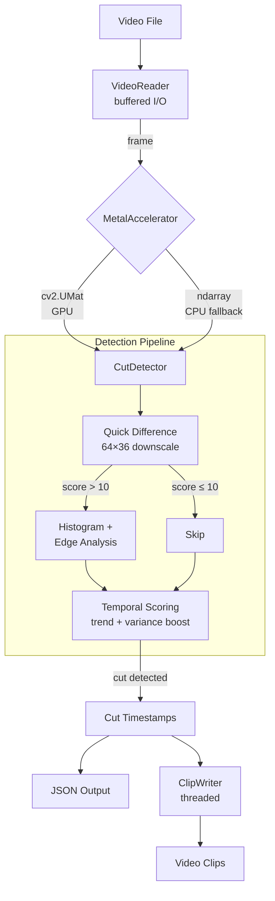

# metalcut

GPU-accelerated video cut detection for Apple Silicon.

## Installation

1. Create virtual environment:
   ```bash
   python3 -m venv venv
   source venv/bin/activate
   ```

2. Install dependencies:
   ```bash
   pip install -r requirements.txt
   ```

## Architecture



## Usage

```bash
python -m src.cli.main --input video.mp4 --sensitivity 0.5
```

