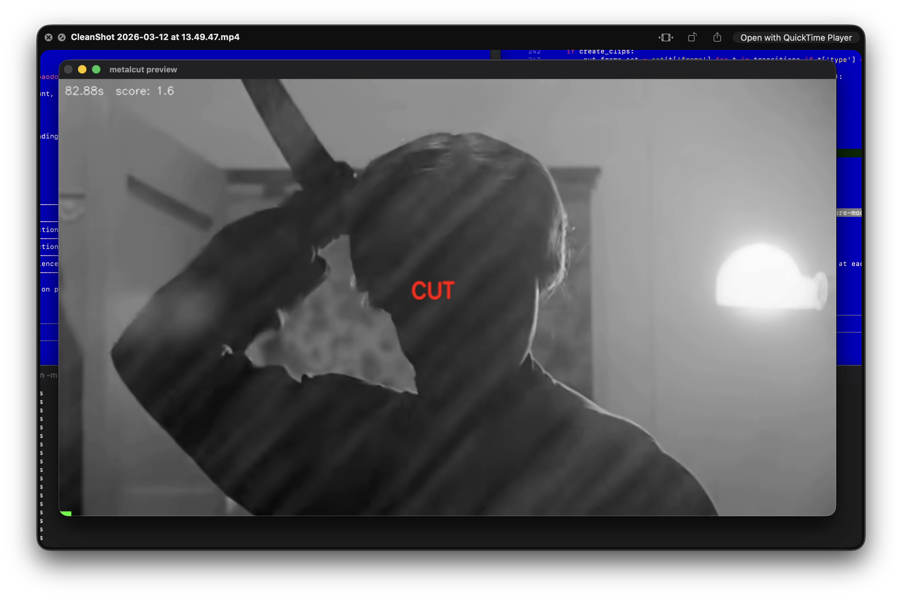
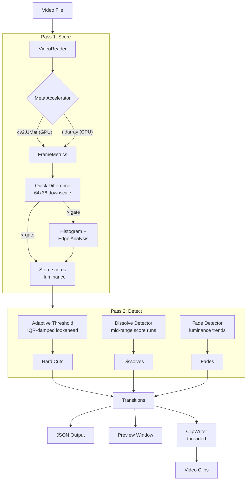

# metalcut

[](https://www.python.org/downloads/)
[]()
[](https://opencv.org/)
[](LICENSE)

GPU-accelerated video cut detection for Apple Silicon. Detects hard cuts, dissolves, and fades using a two-pass scoring pipeline with adaptive thresholding.



## Installation

```bash
python3 -m venv venv
source venv/bin/activate
pip install -r requirements.txt
```

## Usage

```bash
# Detect cuts and transitions
python -m src.cli.main --input video.mp4 --sensitivity 0.7 --score-mode max

# Save results to JSON
python -m src.cli.main --input video.mp4 --sensitivity 0.7 --score-mode max --output-json

# Preview with real-time playback and transition annotations
python -m src.cli.main --input video.mp4 --sensitivity 0.7 --score-mode max --preview

# Diagnose scores for a specific time range
python -m src.cli.main --input video.mp4 --sensitivity 0.7 --score-mode max --diagnose "16.47-21.10"

# Create clips at cut points
python -m src.cli.main --input video.mp4 --sensitivity 0.7 --score-mode max --create-clips

# Use a custom config file
python -m src.cli.main --input video.mp4 --config my_config.json
```

### Options

| Flag | Description |
|------|-------------|
| `--input` | Input video path (required) |
| `--sensitivity`, `-s` | Detection sensitivity 0.0-1.0 (higher = more cuts) |
| `--score-mode` | `max` (best-of signals) or `weighted` (weighted average) |
| `--output-json` | Save transitions to `output/json/` |
| `--preview`, `-p` | Replay video with score overlay and transition labels |
| `--diagnose` | Dump per-frame scores for a time range (e.g. `"16.47-21.10"`) |
| `--create-clips`, `-c` | Split video into clips at cut points |
| `--config` | Path to config JSON (default: `config/default_config.json`) |
| `--min-cut-distance`, `-d` | Minimum seconds between cuts |
| `--output-dir`, `-o` | Output directory (default: `output`) |
| `--debug` | Enable debug logging |

## Architecture



### Two-pass pipeline

**Pass 1 (Score):** Every frame is scored against its predecessor. The GPU-accelerated `MetalAccelerator` converts frames to `cv2.UMat` for Metal/OpenCL processing on Apple Silicon, with automatic CPU fallback. `FrameMetrics` runs a fast 64x36 downscaled difference check, then full histogram correlation + Canny edge analysis for candidates above the gate. Scores and luminance are stored for Pass 2.

**Pass 2 (Detect):** With all scores available, three detectors run:

- **Hard cuts** use adaptive thresholding with symmetrical lookahead (±15 frames). An IQR-based damping mechanism reduces the adaptive margin when the neighborhood has high score spread (bimodal: spikes + zeros), preserving rapid-fire editorial cuts while suppressing sustained action sequences.
- **Dissolves** find sustained runs of mid-range scores, filtered by proximity to hard cuts and bell-curve shape requirements.
- **Fades** track mean luminance to find fade-to-black and fade-from-black transitions.

### Score modes

- **`max`** (default): Takes the strongest individual signal (`max(quick, histogram, edge)`). Best for content where one metric dominates.
- **`weighted`**: Classic weighted average (0.4 quick + 0.4 histogram + 0.2 edge).

## Output

### JSON format

```json
{
  "video_path": "video.mp4",
  "parameters": { "sensitivity": 0.7, "min_cut_distance": 0.15 },
  "processing_time": 6.49,
  "transitions": [
    { "timestamp": 13.93, "type": "hard_cut" },
    { "timestamp": 44.54, "type": "dissolve", "duration": 2.17, "avg_score": 7.4 },
    { "timestamp": 55.93, "type": "fade_to_black", "duration": 0.63 }
  ]
}
```

### Transition types

| Type | Description |
|------|-------------|
| `hard_cut` | Abrupt scene change (single frame boundary) |
| `dissolve` | Cross-fade between two shots over multiple frames |
| `fade_to_black` | Scene fading to black |
| `fade_from_black` | Scene emerging from black |

## Configuration

All parameters are tunable via `config/default_config.json` with CLI overrides taking priority. Key parameters:

| Parameter | Default | Description |
|-----------|---------|-------------|
| `sensitivity` | 0.5 | 0.0-1.0, inversely scales detection thresholds |
| `score_mode` | `max` | `max` or `weighted` |
| `lookahead_frames` | 15 | Neighborhood window for adaptive thresholding |
| `adaptive_margin` | 12.0 | Score must exceed neighborhood p75 + margin |
| `dissolve_min_frames` | 8 | Minimum frames for a dissolve detection |
| `fade_min_frames` | 15 | Minimum frames for a fade detection |

## Tools

```bash
# Evaluate detection against manual annotations
python tools/evaluate.py

# Download test videos
python tools/download_videos.py --urls data/urls.txt --output-dir data/videos

# Annotate cuts with GUI reviewer
python tools/annotate_cuts.py
```
